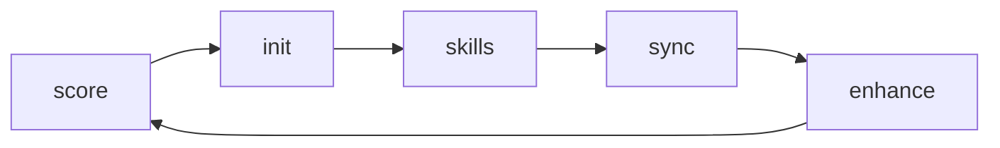
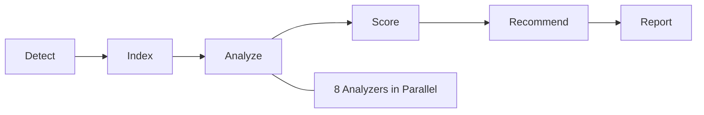

<div align="center">

# claude-adapt

**The Claude Code configuration tool for any codebase.**

Analyze your repo, generate optimized CLAUDE.md and `.claude/` config, install community skill packs, and keep everything evolving — so Claude Code works like a senior team member from day one.

[](https://www.npmjs.com/package/claude-adapt)
[](https://www.npmjs.com/package/claude-adapt)
[](https://github.com/kimbelas/claude-adapt)
[](https://github.com/kimbelas/claude-adapt/actions/workflows/ci.yml)
[](https://github.com/kimbelas/claude-adapt/blob/main/LICENSE)
[](https://nodejs.org)

[Installation](#installation) | [Quick Start](#quick-start) | [Commands](#commands) | [Contributing](CONTRIBUTING.md)

</div>

---

## Installation

```bash
npm install -g claude-adapt
```

Or run directly without installing:

```bash
npx claude-adapt score
```

**Requirements:** Node.js >= 18

---

## Quick Start

```bash
# Step 1 — Score your repo's Claude Code readiness (0-100)
claude-adapt score

# Step 2 — Auto-fix what it can (missing configs, coverage, docs, etc.)
claude-adapt score --fix

# Step 3 — Generate optimized .claude/ config from the results
claude-adapt init
```

`--fix` automatically creates missing `.editorconfig`, `.prettierrc`, CI pipelines, `ARCHITECTURE.md`, coverage config, and more — 15 auto-fixable improvements in one command. Use `--dry-run` to preview first.

<details>
<summary>Optional: extend and evolve</summary>

```bash
claude-adapt skills add             # Install skill packs for your stack (React, Laravel, etc.)
claude-adapt sync                   # After a Claude session, update config with what it learned
claude-adapt enhance                # Find and fix gaps in your existing config
```

</details>

---

## Why claude-adapt?

Claude Code is powerful — but its effectiveness depends entirely on how well your project is set up for it.

| Without claude-adapt | With claude-adapt |
|---|---|
| No CLAUDE.md, Claude guesses at conventions | Tailored CLAUDE.md generated from static analysis |
| 1000-line files, Claude loses context | Modularity scoring flags files to split |
| Config goes stale after a week | `sync` evolves config after every session |
| Manual setup, easy to get wrong | One command, intelligent defaults |
| No way to measure improvement | Score tracks progress over time |

---

## The Lifecycle



Each phase feeds the next: **score** drives config generation, **skills** enhance the scoring, **sync** refreshes everything as your project evolves, and **enhance** closes the gaps that manual editing misses. A self-reinforcing loop.

---

## Example Output

```
╭─────────────────────────────────────╮
│  claude-adapt score  •  v0.1.0      │
│  Repo: my-project                   │
╰─────────────────────────────────────╯

  Claude Code Readiness Score: 67.0/100  ██████████████░░░░░░

  TIER 1 (Core Effectiveness)
  ● Documentation       ████████░░░░  14.0/20  Missing API docs
  ● Modularity          ██████████░░  17.0/20  3 files over 500 lines
  ● Conventions         ████████████  20.0/20  Excellent consistency

  TIER 2 (Enhancement)
  ○ Type Safety         ████████░░░░   8.0/12  strict mode disabled
  ○ Test Coverage       ████░░░░░░░░   4.0/12  Low test-to-source ratio
  ○ Git Hygiene         ██████░░░░░░   4.0/8   Inconsistent commit msgs

  TIER 3 (Quality Signals)
  ◦ CI/CD               ████████████   4.0/4   GitHub Actions detected
  ◦ Dependencies        ████████████   4.0/4   All healthy

  RECOMMENDATIONS (ranked by impact/effort)
  1. [LOW effort · +4 pts] Break up src/utils/helpers.ts (847 lines)
  2. [LOW effort · +3 pts] Enable strict mode in tsconfig.json
  3. [MED effort · +5 pts] Add JSDoc to exported functions in src/api/

  Run 'claude-adapt init' to generate optimized config →
```

---

## Commands

### `score` — Claude Code Readiness Assessment

Performs static analysis across 8 categories, producing a weighted score from 0 to 100. Every signal is calibrated around one question: **"How effectively can Claude Code work in this repo?"**

#### Scoring Categories

| Tier | Category | Weight | What It Measures |
|---|---|---|---|
| **1** | Documentation | 20 | README quality, inline comments, API docs, architecture docs |
| **1** | Modularity | 20 | File sizes, function lengths, coupling, circular deps |
| **1** | Conventions | 20 | Naming consistency, linter/formatter config, folder structure |
| **2** | Type Safety | 12 | Type coverage, strict mode, `any` usage, type definitions |
| **2** | Test Coverage | 12 | Test ratio, runner config, coverage setup |
| **2** | Git Hygiene | 8 | .gitignore quality, commit conventions, commit sizes |
| **3** | CI/CD | 4 | Pipeline config, build/deploy scripts |
| **3** | Dependencies | 4 | Lockfile, dependency count, health |

38 individual signals, each with confidence scoring. Uncertain signals pull toward neutral (0.5), not zero — so a missing metric does not penalize you unfairly.

```
npx claude-adapt score [path] [options]

Options:
  --fix                   Auto-fix what it can (15 auto-fixable improvements)
  --dry-run               Preview fixes without writing
  -f, --format <type>     terminal | json (default: terminal)
  -o, --output <path>     Write report to file
  --ci                    CI mode: exit code = score < threshold
  --threshold <n>         CI failure threshold (default: 50)
  --category <names...>   Score specific categories only
  --compare <commit>      Compare against historical run
  --verbose               Show individual signal details
  --quiet                 Score number only
```

#### Auto-Fix

`--fix` automatically applies improvements that don't require human judgment:

| Fix | What It Does |
|---|---|
| `.editorconfig` | Creates editor config with project-appropriate defaults |
| `.prettierrc` | Creates formatter config + installs prettier |
| `ARCHITECTURE.md` | Creates architecture docs skeleton |
| `CHANGELOG.md` | Creates changelog template |
| `.gitignore` | Appends missing patterns for your ecosystem |
| CI pipeline | Creates GitHub Actions workflow for your stack |
| `tsconfig.json` | Enables strict mode |
| Coverage config | Adds coverage settings to vitest/jest config |
| `@types/*` | Installs missing type definitions |
| Lockfile | Generates lockfile if missing |
| Linter config | Creates ESLint config if eslint is installed |
| Build scripts | Adds missing npm scripts |

---

### `init` — Smart Config Generator

Consumes the detection and analysis pipeline and compiles it into a complete `.claude/` directory tailored to your project. Not a template scaffolder — an intelligent config compiler.

```bash
npx claude-adapt init               # Smart defaults, zero questions
npx claude-adapt init -i            # Interactive mode
npx claude-adapt init --preset strict  # Named safety profile
```

#### What Gets Generated

```
.claude/
├── CLAUDE.md              # Project instructions tailored to your codebase
├── settings.json          # Permissions and safety guardrails
├── commands/              # Custom slash commands for your workflow
│   ├── test.md
│   ├── lint.md
│   └── commit.md
├── hooks/
│   ├── pre-commit.sh
│   └── post-session.sh
└── mcp.json               # Recommended MCP server configs
```

#### Safety Presets

| Preset | Use Case |
|---|---|
| `minimal` | Solo devs, personal projects (broad trust) |
| `standard` | Team projects (balanced) — **DEFAULT** |
| `strict` | Production/enterprise (maximum safety) |

---

### `enhance` — Configuration Improvement Engine

Analyzes your existing `.claude/` configuration and produces an actionable improvement plan. Gap analysis across 17 rules, quality scoring across 5 dimensions.

```bash
npx claude-adapt enhance              # See what's missing
npx claude-adapt enhance --apply      # Apply suggestions (additive-only)
npx claude-adapt enhance --dry-run    # Preview changes first
```

#### Quality Scoring

| Dimension | Range | What It Measures |
|---|---|---|
| **Coverage** | 0-30 | How many recommended sections are present |
| **Depth** | 0-20 | Content richness and detail level |
| **Specificity** | 0-20 | Project-specific vs generic boilerplate |
| **Accuracy** | 0-15 | Versions match what is installed |
| **Freshness** | 0-15 | Content reflects current project state |

---

### `skills` — Community Plugin Ecosystem

Skills are portable bundles of Claude Code configuration — CLAUDE.md fragments, commands, hooks, MCP configs — packaged as npm modules.

```bash
npx claude-adapt skills search react    # Find skills
npx claude-adapt skills add <name>      # Install
npx claude-adapt skills list            # See installed
npx claude-adapt skills remove <name>   # Clean removal
```

Everything is source-tracked. Install is atomic — full success or full rollback. Removal is surgical — no config debris left behind. Skills can add restrictions but **never remove them** (additive-only security).

---

### `sync` — Living Context Engine

After every Claude Code session, `sync` analyzes what happened and incrementally updates your configuration.

```bash
npx claude-adapt sync                 # Run manually
# Or automatically via post-session hook (set up by init)
```

**What it tracks:** architectural decisions, hotspot files, convention drift, cross-session insights, score changes.

**Safety:** Never deletes manual content. Only applies high-confidence decisions (>= 0.7). Rate limited to 5 changes per sync. Size bounded to 10KB of sync-owned content.

---

## CI Integration

```yaml
# .github/workflows/claude-adapt.yml
name: Claude Code Readiness
on: [push, pull_request]

jobs:
  score:
    runs-on: ubuntu-latest
    steps:
      - uses: actions/checkout@v4
      - uses: actions/setup-node@v4
        with:
          node-version: '20'
      - run: npx claude-adapt score --ci --threshold 60
```

---

## Architecture



**Pipeline architecture** — each stage is cacheable, parallelizable, and swappable. **Tapable hooks** — Webpack-style plugin system. **Worker thread parallelism** — large repos don't block. **Content-hash caching** — skip unchanged files. **IoC container** — dependency injection for testability.

<details>
<summary>Directory structure</summary>

```
claude-adapt/
├── src/
│   ├── core/                    # Engine (pipeline, plugins, scoring, detection, DI)
│   ├── analyzers/               # 8 category analyzers with language enhancers
│   ├── reporters/               # Terminal, JSON output renderers
│   ├── recommendations/         # Impact x effort recommendation engine
│   ├── history/                 # Score tracking + trend detection
│   ├── generators/              # Init: CLAUDE.md, settings, commands, hooks, MCP
│   ├── skills/                  # Skills: registry, installer, merger, validator
│   ├── context/                 # Sync: tracker, knowledge store, updater
│   ├── enhance/                 # Enhance: gap analysis, quality scoring
│   ├── commands/                # Thin CLI layer (delegates to core)
│   └── cli.ts                   # Commander.js entry point
├── templates/                   # CLAUDE.md generation templates
├── skills/                      # Built-in starter skills
└── test/                        # Fixtures and test suites
```

</details>

---

## Roadmap

### v1.0 — Foundation
- [x] `score` — 8 categories, 38 signals, terminal + JSON output
- [x] `init` — CLAUDE.md, settings, commands, hooks, MCP generation
- [x] `skills` — Manifest format, merge engine, local installation
- [x] `sync` — Decision detection, hotspot tracking, CLAUDE.md evolution
- [x] `enhance` — Gap analysis, quality scoring, config improvement

### v1.x — Ecosystem
- [ ] Curated skill index
- [ ] VS Code extension
- [ ] Official GitHub Action
- [ ] Built-in skills: React, Vue, Django, Rails, Go, Rust

### v2.0 — Intelligence
- [ ] AI-powered CLAUDE.md generation
- [ ] Team mode (shared context across developers)
- [ ] PR-aware scoring (score the diff, not just the repo)
- [ ] Custom scoring categories via plugins

---

## Contributing

We welcome contributions! The easiest ways to start:

1. **Create a skill** — publish a `claude-skill-*` package for your framework
2. **Add a language enhancer** — improve scoring accuracy for your language
3. **Report signal calibration issues** — help us tune thresholds with real-world data

See [CONTRIBUTING.md](CONTRIBUTING.md) for the full guide.

---

<div align="center">

MIT &copy; [Kim Belas](https://github.com/kimbelas)

</div>
