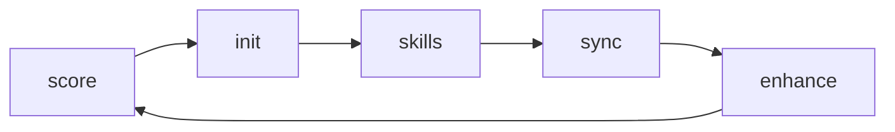
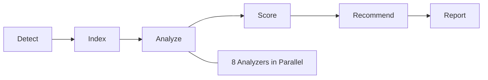
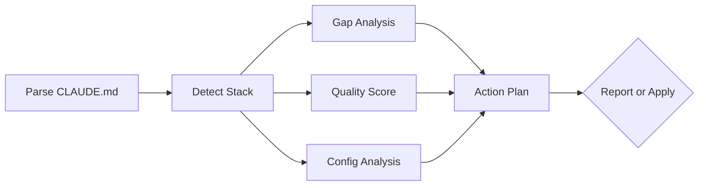
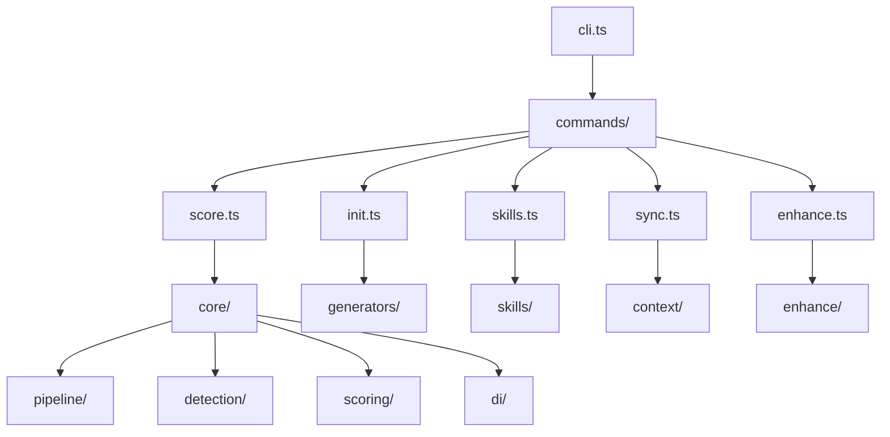
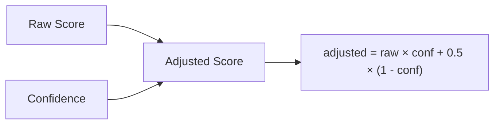

# claude-adapt

[](https://www.npmjs.com/package/claude-adapt)
[](https://www.npmjs.com/package/claude-adapt)
[](https://github.com/kimbelas/claude-adapt/blob/main/LICENSE)
[](https://github.com/kimbelas/claude-adapt/actions/workflows/ci.yml)
[](https://nodejs.org)

**Make any codebase Claude Code-ready in one command.**

`claude-adapt` scans your project, scores its Claude Code readiness, generates optimized configuration, keeps it evolving across sessions, and continuously improves it through gap analysis — so Claude Code works like a senior team member from day one.

```bash
npx claude-adapt score        # How ready is this repo?
npx claude-adapt init         # Generate optimized .claude/ config
npx claude-adapt skills add   # Install domain-specific skill packs
npx claude-adapt sync         # Keep config alive across sessions
npx claude-adapt enhance      # Improve existing config with gap analysis
```



---

## How It Works

Claude Code is powerful — but its effectiveness depends entirely on how well your project is set up for it. A repo with no documentation, 1000-line files, and no tests gives Claude Code almost nothing to work with. A well-structured repo with clear conventions, focused modules, and a good CLAUDE.md makes Claude Code feel like magic.

**The problem:** Most projects are not optimized for AI-assisted development. Setting up CLAUDE.md, hooks, commands, and MCP servers manually is tedious and easy to get wrong. And once you do set it up, the config goes stale within a week as the codebase evolves.

**The solution:** `claude-adapt` solves this with a five-phase lifecycle. Each phase feeds the next: the score drives config generation, skills enhance the scoring, sync refreshes everything as your project evolves, and enhance closes the gaps that manual editing misses. It is a self-reinforcing loop that keeps your Claude Code configuration accurate and effective over time.

The core engine uses a pipeline architecture — every operation flows through discrete, cacheable, parallelizable stages:



Each stage in the pipeline is independent and composable:

1. **Detect** — Identifies languages, frameworks, package managers, tooling, and monorepo structure
2. **Index** — Builds a virtual filesystem with lazy AST parsing (only parses when an analyzer needs it)
3. **Analyze** — Eight category analyzers run in parallel via worker threads, each producing scored signals
4. **Score** — Confidence-weighted aggregation across all signals with tier-based weighting
5. **Recommend** — Ranks improvements by `(gap x impact) / effort` to surface the highest-value changes first
6. **Report** — Renders the final output in your chosen format (terminal or JSON)

---

## Quick Start

```bash
# Score your project (zero config, works on any repo)
npx claude-adapt score

# Generate optimized Claude Code configuration
npx claude-adapt init

# Install skill packs for your stack
npx claude-adapt skills add claude-skill-laravel

# After a Claude Code session, sync your config
npx claude-adapt sync

# Analyze and improve your existing config
npx claude-adapt enhance
```

---

## Installation

```bash
# Run directly (no install)
npx claude-adapt score

# Install globally
npm install -g claude-adapt

# As a dev dependency
npm install -D claude-adapt
```

**Requirements:** Node.js >= 18

---

## Commands

### `score` — Claude Code Readiness Assessment

Performs static analysis across 8 categories, producing a weighted score from 0 to 100. Every signal is calibrated around one question: **"How effectively can Claude Code work in this repo?"**

```
$ npx claude-adapt score

╭─────────────────────────────────────╮
│  claude-adapt score  •  v1.0.0      │
│  Repo: my-project                   │
│  Languages: TypeScript, Python      │
│  Framework: Next.js                 │
╰─────────────────────────────────────╯

  Claude Code Readiness Score: 67/100  ██████████████░░░░░░

  TIER 1 (Core Effectiveness)
  ● Documentation       ████████░░░░  14/20  Missing API docs
  ● Modularity          ██████████░░  17/20  3 files over 500 lines
  ● Conventions         ████████████  20/20  Excellent consistency

  TIER 2 (Enhancement)
  ○ Type Safety         ████████░░░░   8/12  strict mode disabled
  ○ Test Coverage       ████░░░░░░░░   4/12  Low test-to-source ratio
  ○ Git Hygiene         ██████░░░░░░   4/8   Inconsistent commit msgs

  TIER 3 (Quality Signals)
  ◦ CI/CD               ████████████   4/4   GitHub Actions detected
  ◦ Dependencies        ████████████   4/4   All healthy

  📈 Type Safety improving — 3 run streak
  ⚠️  Test Coverage declining over last 4 runs

  RECOMMENDATIONS (ranked by impact/effort)
  1. [LOW effort · +4 pts] Break up src/utils/helpers.ts (847 lines)
  2. [LOW effort · +3 pts] Enable strict mode in tsconfig.json
  3. [MED effort · +5 pts] Add JSDoc to exported functions in src/api/

  Run 'claude-adapt init' to generate optimized config →
```

#### Scoring Categories

| Tier | Category | Weight | What It Measures |
|---|---|---|---|
| **1** | Documentation | 20 | README quality, inline comments, API docs, architecture docs |
| **1** | Modularity | 20 | File sizes, function lengths, coupling, circular deps |
| **1** | Conventions | 20 | Naming consistency, linter/formatter config, folder structure |
| **2** | Type Safety | 12 | Type coverage, strict mode, `any` usage, type definitions |
| **2** | Test Coverage | 12 | Test ratio, runner config, coverage setup |
| **2** | Git Hygiene | 8 | .gitignore quality, commit conventions, commit sizes |
| **3** | CI/CD | 4 | Pipeline config, build/deploy scripts |
| **3** | Dependencies | 4 | Lockfile, dependency count, health |

38 individual signals across these categories, each with confidence scoring that prevents uncertain measurements from tanking your score. Uncertain signals pull toward neutral (0.5), not zero — so a missing metric does not penalize you unfairly.

#### Score Options

```
npx claude-adapt score [path] [options]

Options:
  -f, --format <type>     terminal | json (default: terminal)
  -o, --output <path>     Write report to file
  --ci                    CI mode: exit code = score < threshold
  --threshold <n>         CI failure threshold (default: 50)
  --category <names...>   Score specific categories only
  --workspace <path>      Score a monorepo workspace
  --compare <commit>      Compare against historical run
  --verbose               Show individual signal details
  --quiet                 Score number only
  --no-history            Don't persist to history
  --no-cache              Force full rescan
```

#### History Tracking

Every run is recorded in `.claude-adapt/history.json`. The score report shows trends, regressions, and improvement streaks automatically. Use `--compare` to diff against any previous run.

---

### `init` — Smart Config Generator

Consumes the detection and analysis pipeline and compiles it into a complete `.claude/` directory tailored to your project. Not a template scaffolder — an intelligent config compiler.

```bash
npx claude-adapt init           # Smart defaults, zero questions
npx claude-adapt init -i        # Interactive mode, confirm each choice
npx claude-adapt init --preset strict  # Named safety profile
```

#### What Gets Generated

```
.claude/
├── CLAUDE.md              # Project instructions tailored to your codebase
├── settings.json          # Permissions and safety guardrails
├── commands/              # Custom slash commands for your workflow
│   ├── test.md            # /test — run + analyze tests
│   ├── lint.md            # /lint — auto-fix + report
│   └── commit.md          # /commit — conventional commit workflow
├── hooks/
│   ├── pre-commit.sh      # Lint + format + type check
│   └── post-session.sh    # Trigger sync after sessions
└── mcp.json               # Recommended MCP server configs
```

#### Intelligent Detection

`init` detects your stack and generates config accordingly:

| Detected | Config Generated |
|---|---|
| Next.js + TypeScript | App Router conventions, strict tsconfig guidance, component patterns |
| Laravel + PHP | Artisan commands, Eloquent patterns, migration conventions |
| PostgreSQL (in docker-compose) | MCP server config, migration tool docs, schema patterns |
| Jest + Prettier + ESLint | Pre-commit hooks, test commands, auto-format settings |
| GitHub Actions | CI workflow names, required checks, pre-push validation |
| Monorepo (Nx/Turborepo) | Workspace-aware commands, package boundary rules |

#### Safety Presets

```
--preset minimal    Solo devs, personal projects (broad trust)
--preset standard   Team projects (balanced — DEFAULT)
--preset strict     Production/enterprise (maximum safety)
```

#### Init Options

```
npx claude-adapt init [path] [options]

Options:
  -i, --interactive       Confirm/override each section
  --preset <name>         minimal | standard | strict
  --skip <generators...>  Skip: claude-md | settings | commands | hooks | mcp
  --only <generators...>  Generate only specific outputs
  --force                 Overwrite existing .claude/
  --dry-run               Preview without writing
  --diff                  Show diff against existing config
  --merge                 Merge with existing (don't overwrite)
  --no-score              Skip scoring for faster output
  --template <path>       Custom base template for CLAUDE.md
```

---

### `enhance` — Configuration Improvement Engine

Analyzes your existing `.claude/` configuration and produces an actionable improvement plan. Runs gap analysis across 17 rules, quality scoring across 5 dimensions, and config analysis against best practices.

Use `enhance` in these situations:

- **After `init`** — close the gaps that automatic generation missed
- **After major refactors** — your config has not kept up with structural changes
- **Periodically** — catch stale version references and missing documentation
- **Before onboarding** — make sure your config is comprehensive for new team members

```
$ npx claude-adapt enhance

╭─────────────────────────────────────╮
│  claude-adapt enhance  •  v0.1.0   │
│  Project: my-app                    │
╰─────────────────────────────────────╯

  CLAUDE.md Quality Score: 42/100

  Coverage    ██████████████░░░░░░░░░░░░░░░░  18/30
  Depth       ██████████░░░░░░░░░░          10/20
  Specificity ████████░░░░░░░░░░░░           8/20
  Accuracy    ██████████████░                13/15
  Freshness   ██████████░░░░░                10/15

  SUGGESTIONS (12 found, ranked by impact)

  HIGH PRIORITY
  ● [missing] Add Environment Variables section         +8 pts
    .env has 12 vars not documented in CLAUDE.md
  ● [missing] Add Security Policy section               +6 pts
    Supabase detected but no RLS documentation
  ● [security] Document auth middleware patterns         +5 pts

  MEDIUM PRIORITY
  ○ [incomplete] Expand framework conventions            +4 pts
    Next.js detected but only 2 patterns documented
  ○ [stale] Update Node.js version reference             +3 pts
    CLAUDE.md says 18, package.json requires 20

  CONFIG SUGGESTIONS (4 found)
  + Add /deploy command (deployment scripts detected)
  + Add pre-push hook (CI pipeline detected)
  + Configure PostgreSQL MCP server (database detected)

  Run 'claude-adapt enhance --apply' to apply suggestions →
```

#### Gap Analysis (17 Rules)

The gap analyzer checks your CLAUDE.md against 17 rules organized by category:

| Category | Rules Checked |
|---|---|
| **Missing** | Environment variables, route structure, security policy, architecture overview, testing strategy, common tasks, gotchas, tech stack, conventions |
| **Incomplete** | Framework patterns, test runner config, linter setup |
| **Stale** | Framework version, package manager version |
| **Security** | Supabase RLS documentation, auth policy |
| **Tasks** | npm scripts coverage |

Each rule produces a suggestion with a point estimate — the predicted score improvement if addressed.

#### Quality Scoring (5 Dimensions)

| Dimension | Range | What It Measures |
|---|---|---|
| **Coverage** | 0-30 | How many recommended sections are present |
| **Depth** | 0-20 | Content richness and detail level |
| **Specificity** | 0-20 | Project-specific vs generic boilerplate content |
| **Accuracy** | 0-15 | Framework/tool versions match what is actually installed |
| **Freshness** | 0-15 | Content reflects current project state, not stale snapshots |

The total quality score ranges from 0 to 100. Anything below 50 means your CLAUDE.md is leaving significant effectiveness on the table.

#### Config Analysis

Beyond CLAUDE.md, `enhance` also inspects:

- **settings.json** — Missing permission configurations, overly broad or overly restrictive rules
- **commands/** — Slash commands that could be added based on detected workflows (deploy, test, migrate)
- **hooks/** — Hook opportunities based on CI pipelines and tooling
- **mcp.json** — MCP server configurations for detected databases, APIs, and services

#### Enhance Pipeline



#### Enhance Options

```
npx claude-adapt enhance [path] [options]

Options:
  --apply                 Apply suggestions (adds missing sections, never overwrites)
  --dry-run               Preview changes without writing
  --verbose               Show evidence details and draft content
  --format <type>         Output format: terminal | json (default: terminal)
  --categories <list>     Filter by category (comma-separated: missing,incomplete,stale,security,environment,routes,tasks)
  --no-score              Skip scoring (faster, fewer staleness checks)
```

The `--apply` flag is additive-only: it inserts missing sections and appends missing details, but never overwrites or removes content you wrote manually. Use `--dry-run` first to preview exactly what would change.

Typical workflow:

```bash
# See what's missing
npx claude-adapt enhance

# Preview changes before applying
npx claude-adapt enhance --apply --dry-run

# Apply the suggestions
npx claude-adapt enhance --apply

# Check specific categories only
npx claude-adapt enhance --categories security,stale
```

---

### `skills` — Community Plugin Ecosystem

Skills are portable bundles of Claude Code configuration — CLAUDE.md fragments, commands, hooks, MCP configs, and scoring enhancers — packaged as npm modules.

```bash
# Search for skills
npx claude-adapt skills search laravel

# Install a skill
npx claude-adapt skills add claude-skill-laravel

# See what's installed
npx claude-adapt skills list

# Remove cleanly
npx claude-adapt skills remove claude-skill-laravel
```

#### How Skills Work

A skill merges its content into your existing `.claude/` directory:

- **CLAUDE.md sections** are inserted at specified anchor points with priority ordering
- **Commands** are added as new `.md` files in `.claude/commands/`
- **Hooks** are composed as priority-ordered blocks within hook scripts
- **Settings** are additive — skills can add restrictions but never remove them
- **MCP configs** are merged into `mcp.json`
- **Scoring enhancers** add domain-specific signals to the score command

Everything is source-tracked. Removal is surgical — no config debris left behind.

#### Available Skills

```
npx claude-adapt skills search react

  VERIFIED
  ⚛️  claude-skill-react         v1.2.0  ★★★★★  15.2k/week
     Component patterns, hooks conventions, testing with RTL

  COMMUNITY
  📱 claude-skill-react-native   v0.9.1  ★★★★☆  4.1k/week
     Mobile patterns, navigation, native modules
```

#### Auto-Discovery

During `init`, skills are automatically suggested based on your detected stack:

```
📦 Recommended skills for this project:
✓ claude-skill-laravel (framework detected)
✓ claude-skill-docker (docker-compose detected)
○ claude-skill-postgresql (database detected)

Install all? [Y/n]
```

#### Creating Skills

```bash
# Scaffold a new skill
npx claude-adapt skills init --template full --framework react

# Validate before publishing
npx claude-adapt skills validate .

# Publish to npm
npx claude-adapt skills publish
```

Skills follow the `claude-skill-*` npm naming convention. See [Creating Skills](docs/creating-skills.md) for the full guide.

#### Skills Options

```
npx claude-adapt skills <command> [options]

Commands:
  add <name[@version]>    Install a skill
  remove <name>           Uninstall (clean removal)
  update [name]           Update one or all skills
  list                    Show installed skills
  search <query>          Search npm + skill index
  info <name>             Show skill details
  init                    Scaffold a new skill
  validate [path]         Validate a skill manifest
  publish                 Publish to npm
```

---

### `sync` — Living Context Engine

After every Claude Code session, `sync` analyzes what happened and incrementally updates your configuration. Your CLAUDE.md stays accurate as the project evolves.

```bash
# Run manually
npx claude-adapt sync

# Or automatically via post-session hook (set up by init)
# .claude/hooks/post-session.sh runs this for you
```

#### What Sync Tracks

- **Architectural decisions** — new dependencies, directory structures, pattern changes
- **Hotspots** — files frequently edited by Claude (risk indicators)
- **Convention drift** — naming patterns shifting, consistency decreasing
- **Cross-session insights** — recurring errors, productivity bottlenecks
- **Score changes** — quick re-score after every sync

#### Example Output

```
$ npx claude-adapt sync

  SESSION SUMMARY
  Commits: 3 (feat: add user auth, fix: token refresh, test: auth tests)
  Files: 12 modified, 5 created, 1 deleted

  DECISIONS DETECTED
  ✓ Added jsonwebtoken dependency (→ Tech Stack)
  ✓ Created src/auth/ directory with 5 files (→ File Structure)
  ✓ Established middleware pattern (→ Key Patterns)

  INSIGHTS
  💡 src/utils/helpers.ts edited in 4 of last 5 sessions — consider splitting

  CLAUDE.MD CHANGES
  + Tech Stack: Added jsonwebtoken
  + File Structure: Added src/auth/
  + Key Patterns: Added middleware pattern docs

  QUICK SCORE: 71/100 (+4 since last sync)
```

#### Safety Guardrails

- Never deletes manual CLAUDE.md content — only appends or updates sync-owned sections
- Only applies high-confidence decisions (>= 0.7 threshold)
- Rate limited: max 5 CLAUDE.md changes per sync
- Size bounded: max 10KB of sync-owned content
- Context store pruned automatically (sessions: 50, decisions: 100, gotchas: 30)

#### Sync Options

```
npx claude-adapt sync [options]

Options:
  --quiet           Minimal output (for hooks)
  --quick           Fast mode: skip insights + quick score only
  --dry-run         Preview changes without writing
  --no-claude-md    Update context store only
  --no-score        Skip quick score
  --reset           Clear context store
  --since <commit>  Analyze from specific commit
  --export <path>   Export context store as report
  --interactive     Confirm each change
  --auto-apply      Apply all without confirmation
```

---

## Configuration

### `.claude-adapt.config.ts`

Optional project-level configuration:

```typescript
import { defineConfig } from 'claude-adapt';

export default defineConfig({
  // Scoring
  score: {
    weights: {
      documentation: 20,
      modularity: 20,
      conventions: 20,
      typeSafety: 12,
      testCoverage: 12,
      gitHygiene: 8,
      cicd: 4,
      dependencies: 4,
    },
    ignore: ['vendor/**', 'dist/**'],
    thresholds: {
      'mod.file.size.p90': { poor: 600, fair: 300, good: 200 },
    },
  },

  // Init
  init: {
    preset: 'standard',
    generators: {
      claudeMd: true,
      settings: true,
      commands: true,
      hooks: true,
      mcp: true,
    },
  },

  // Sync
  sync: {
    autoApply: false,
    confidenceThreshold: 0.7,
    maxChangesPerSync: 5,
    quickScore: true,
  },

  // Skills
  skills: {
    registry: 'https://registry.npmjs.org',
    autoSuggest: true,
  },

  // Enhance
  enhance: {
    categories: ['missing', 'incomplete', 'stale', 'security', 'tasks'],
    autoApply: false,
  },
});
```

### `.claude-adapt-ignore`

Exclude files from analysis (in addition to `.gitignore`):

```
# Generated files
dist/
build/
coverage/

# Large vendored dependencies
vendor/
third-party/

# Binary assets
*.png
*.jpg
*.woff2
```

---

## CI Integration

Use `score` as a CI gate to maintain Claude Code readiness:

```yaml
# .github/workflows/claude-adapt.yml
name: Claude Code Readiness
on: [push, pull_request]

jobs:
  score:
    runs-on: ubuntu-latest
    steps:
      - uses: actions/checkout@v4
      - uses: actions/setup-node@v4
        with:
          node-version: '20'
      - run: npx claude-adapt score --ci --threshold 60
```

The `--ci` flag outputs JSON and sets the exit code based on the threshold — score below threshold means the build fails.

You can also run `enhance` in CI to catch config drift:

```yaml
# Fail if enhance finds high-priority suggestions
- run: npx claude-adapt enhance --format json --categories missing,stale
```

---

## Architecture



### Directory Structure

```
claude-adapt/
├── src/
│   ├── core/                    # Engine (pipeline, plugins, scoring, detection, DI)
│   ├── analyzers/               # 8 category analyzers with language enhancers
│   ├── reporters/               # Terminal, JSON output renderers
│   ├── recommendations/         # Impact × effort recommendation engine
│   ├── history/                 # Score tracking + trend detection
│   ├── generators/              # Init: CLAUDE.md, settings, commands, hooks, MCP
│   ├── skills/                  # Skills: registry, installer, merger, validator
│   ├── context/                 # Sync: tracker, knowledge store, updater
│   ├── enhance/                 # Enhance: gap analysis, quality scoring, config analysis
│   ├── commands/                # Thin CLI layer (delegates to core)
│   └── cli.ts                   # Commander.js entry point
├── plugins/                     # Built-in language enhancers
├── templates/                   # CLAUDE.md generation templates
├── skills/                      # Built-in starter skills
└── test/                        # Fixtures, unit, integration, snapshots
```

### Key Architectural Decisions

- **Pipeline architecture** — Detect, Index, Analyze, Score, Recommend, Report. Each stage is cacheable, parallelizable, and swappable.
- **Tapable hook system** — Webpack-proven plugin architecture. Skills can tap into any pipeline stage via `AsyncSeriesHook`, `AsyncParallelHook`, and `AsyncSeriesWaterfallHook`.
- **Worker thread parallelism** — Analyzers run in parallel via a worker thread pool. Large repos do not block.
- **Content-hash caching** — Skip unchanged files on re-scan.
- **Confidence scoring** — Uncertain signals pull toward neutral, not zero.
- **Transaction-based merging** — Every skill merge is atomic and reversible.
- **Additive-only security** — Skills can add restrictions, never remove them.
- **IoC container** — Lightweight dependency injection for testability. All major services are injectable via tokens.
- **Language agnostic** — Core scoring works on any repo. Language-specific intelligence is added through plugin enhancers, so new languages can be supported without modifying the core engine.

---

## Scoring Deep Dive

The scoring system uses 8 categories with 38 total signals, organized into three tiers with decreasing weight:

| Tier | Categories | Points per Category | Total |
|---|---|---|---|
| **Tier 1** — Core Effectiveness | Documentation, Modularity, Conventions | 20 each | 60 |
| **Tier 2** — Enhancement | Type Safety (12), Test Coverage (12), Git Hygiene (8) | varies | 32 |
| **Tier 3** — Quality Signals | CI/CD, Dependencies | 4 each | 8 |

**Total: 100 points**

Tier 1 categories represent what matters most for Claude Code's effectiveness: can it understand the codebase (documentation), navigate it efficiently (modularity), and follow established patterns (conventions). Tier 2 covers factors that enhance Claude's output quality. Tier 3 captures infrastructure signals.

### Confidence Scoring

Every signal includes a confidence value (0 to 1) that reflects how certain the measurement is. The adjusted score formula prevents low-confidence signals from unfairly penalizing the overall score:



When confidence is high (near 1.0), the adjusted score closely matches the raw score. When confidence is low (near 0.0), the adjusted score pulls toward 0.5 (neutral). This means a signal that could not be measured reliably does not drag your score down — it simply contributes less information.

For example, if a type safety signal has a raw score of 0.3 but only 0.4 confidence, the adjusted score is `0.3 * 0.4 + 0.5 * 0.6 = 0.42` rather than a harsh 0.3.

This design choice matters in practice. Consider a Python project where type coverage cannot be reliably measured because there is no `mypy` configuration. Rather than penalizing the project with a zero for type safety, the low confidence pulls the score toward neutral. The signal effectively says "I do not have enough information to judge this" instead of "this is bad."

### Recommendation Ranking

Recommendations are ranked by the formula `(gap x impact) / effortScore`, where:

- **gap** is the distance between current and ideal score for that signal
- **impact** is the tier weight of the category (Tier 1 signals have higher impact)
- **effortScore** is estimated as 1 (low), 3 (medium), or 5 (high) based on the type of change

This surfaces low-effort, high-impact improvements first — the changes that give you the most score improvement for the least work.

---

## Roadmap

### v1.0 — Foundation
- [x] Phase 1: `score` — 8 categories, 38 signals, terminal + JSON output
- [x] Phase 2: `init` — CLAUDE.md, settings, commands, hooks, MCP generation
- [x] Phase 3: `skills` — Manifest format, merge engine, local installation (npm registry search coming soon)
- [x] Phase 4: `sync` — Decision detection, hotspot tracking, CLAUDE.md evolution
- [x] Phase 5: `enhance` — Gap analysis, quality scoring, config improvement

### v1.x — Ecosystem
- [ ] Skill index (curated registry)
- [ ] VS Code extension (score in status bar)
- [ ] GitHub Action (official)
- [ ] Built-in skills: React, Vue, Django, Rails, Go, Rust

### v2.0 — Intelligence
- [ ] AI-powered CLAUDE.md generation (use Claude API for deeper analysis)
- [ ] Team mode (shared context across developers)
- [ ] PR-aware scoring (score the diff, not just the repo)
- [ ] Custom scoring categories via plugins

---

## Contributing

We welcome contributions! The three easiest ways to get started:

1. **Create a skill** — publish a `claude-skill-*` package for your framework
2. **Add a language enhancer** — improve scoring accuracy for your language
3. **Report signal calibration issues** — help us tune thresholds with real-world data

See [CONTRIBUTING.md](CONTRIBUTING.md) for development setup, coding standards, and the full contribution guide.

---

## License

MIT &copy; [Kim Belas](https://github.com/kimbelas) — see [LICENSE](LICENSE) for details.
